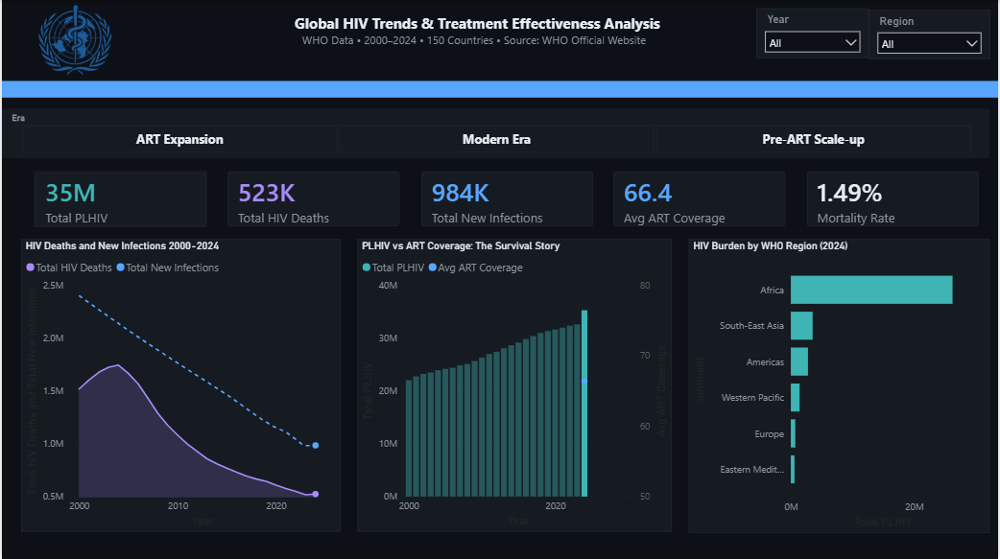
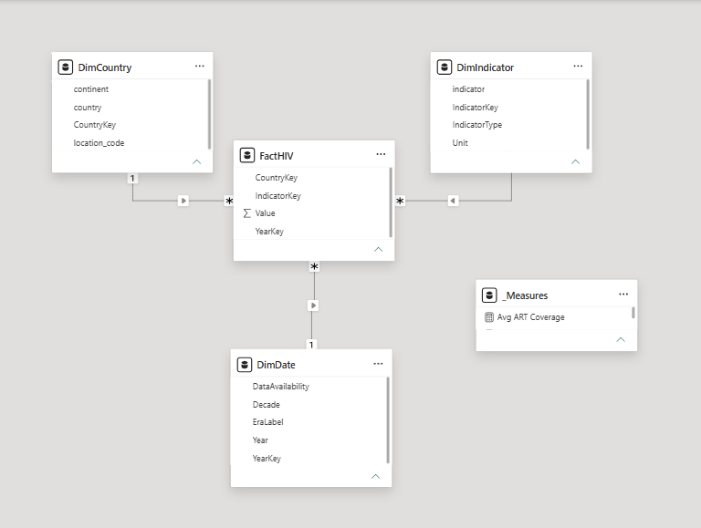
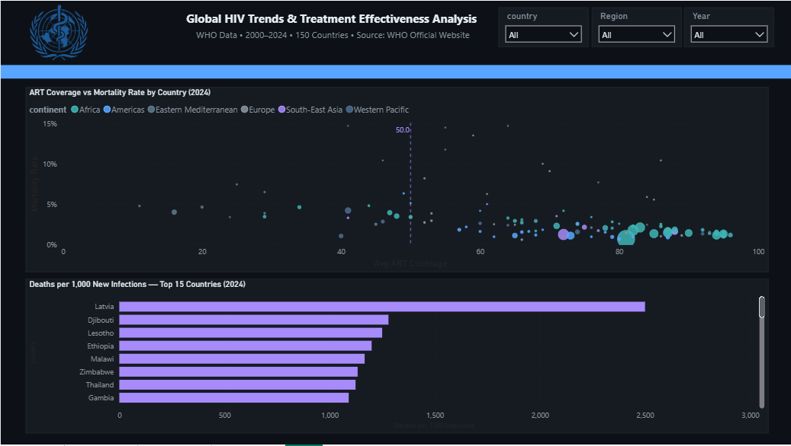
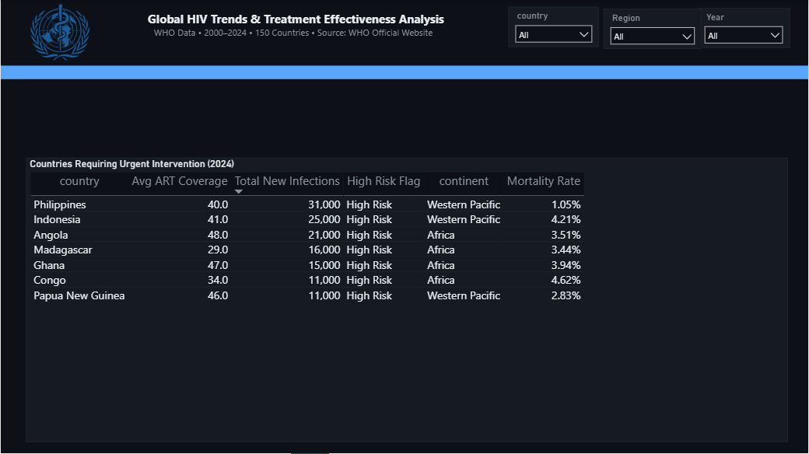

# Global HIV Treatment Effectiveness Analysis

A Power BI analysis of 25 years of WHO HIV data across 150 countries, built to
answer one question global health stakeholders couldn't answer from raw
numbers alone: **is HIV treatment actually working, or are we just measuring
a slower decline?**



## The business problem

Between 2000 and 2024, the number of people living with HIV worldwide rose
from 22 million to 35.2 million, while global health messaging simultaneously
claimed the epidemic was "improving." Both statements are true, and that's
exactly the problem: without a model connecting infection rates, treatment
coverage, and mortality, stakeholders had no way to tell whether rising case
counts meant the epidemic was worsening or whether more people were simply
surviving longer under treatment. Resource allocation was also untargeted:
there was no systematic way to identify which specific countries combined
high infection burden with low treatment access.

## The approach

- Sourced 9,763 records across 150 countries and 4 indicators (new infections,
  deaths, people living with HIV, ART coverage) from WHO's published data.
- Modelled the data as a star schema: one fact table (`FactHIV`) against
  three dimension tables (`DimCountry`, `DimIndicator`, `DimDate`), so every
  DAX measure stays accurate regardless of which filters are applied, and new
  indicators can be added later without rebuilding the model.
- Wrote 10 DAX measures to calculate mortality rate, ART coverage averages,
  and year-on-year change.
- Built a 3-page report: a global overview, a correlation analysis, and a
  ranked list of countries needing urgent intervention.



## The insight

The headline finding: **rising PLHIV (people living with HIV) numbers are a
survival metric, not a sign the epidemic is worsening.** ART coverage rose
from 6.8% to 66.4% over the same period that mortality fell from 7.8% to
1.49%. People are surviving, not disappearing from the count. The data also
surfaced something more concerning underneath that positive trend: HIV deaths
rose 1.17% in 2024, the first increase after two decades of decline. This is a signal
worth watching, not yet a trend.



## The recommendation

Cross-referencing new infections against ART coverage identified **7
countries** where both high infection burden (>10,000 new infections) and low
treatment access (<50% ART coverage) occur simultaneously, led by the
Philippines (31,000 new infections) and Madagascar (29% ART coverage, the
lowest of the seven). These are the countries where additional ART investment
is likely to have the greatest impact, rather than spreading resources
evenly across all 150 countries in the dataset.



## Tools and techniques

`Power BI` · `Power Query` · `DAX` · `Star schema data modelling` ·
`Dashboard design`

## Repository contents

```
├── power-bi/
│   └── hiv-treatment-effectiveness.pbix   Full Power BI file, including data model and DAX measures
├── data/
│   └── hiv-who-dataset.xlsx                Source dataset (WHO, 2000–2024, 150 countries)
├── screenshots/                             Dashboard pages and data model, referenced above
└── docs/
    └── case-study.md                        Extended write-up: methodology, DAX measures, limitations
```

## Limitations

Documented honestly rather than glossed over, because knowing where a model's
edges are is part of the analysis:

- ART coverage averages are unweighted by population, so small and large
  countries currently count equally in the global average.
- Pre-2020 ART and infection data is only available as 5-year snapshots
  rather than annual figures, which delayed detection of the 2023–2024 uptick
  in deaths.
- Data is aggregated at country level; sub-national variation isn't visible.

## Source

WHO official published HIV statistics, 2000–2024.

## Author

**Marian Ohwerhi**, Healthcare Data Analyst & Registered Mental Health Nurse
[LinkedIn](https://www.linkedin.com/in/marian-ohwerhi/) · [Portfolio](https://marianohwerhi.github.io/portfolio-website/)
